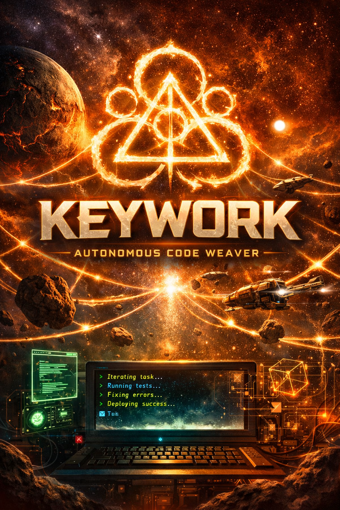

╔══════════════════════════════════╗
║   KEYWORK — Code Weaving Engine  ║
╚══════════════════════════════════╝

# keywork
The connective tissue between intent and implementation.

In The Amory Wars universe, the Keywork is the energy lattice that binds the worlds together — the substrate through which thought, matter, and communication flow. Whoever learns to shape the Keywork can reshape reality itself.

This project borrows that metaphor. Keywork is an autonomous coding agent framework designed to sit between human intent and implemented software — a connective layer that interprets goals, executes iterative development loops, and evolves solutions until they hold together. A fabric between idea and execution.